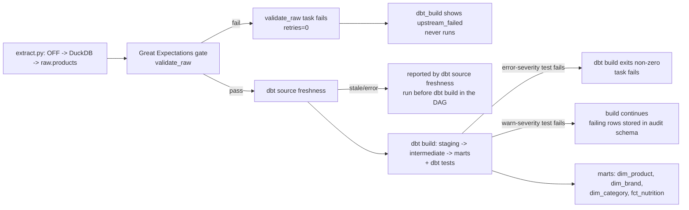

# Data Quality

## 1. Purpose

This document describes how data quality is defined, checked, and enforced across the
pipeline that loads Dutch food products from Open Food Facts into `raw.products` (DuckDB
extraction), through Great Expectations validation, into the dbt-built staging /
intermediate / marts layers in Postgres. It is written for anyone reviewing or extending
the pipeline (including future me): what each check actually verifies, why its threshold
is set where it is, what happens when it fails, and what limitations in the source data
no check can fix. Every number below was queried live against the warehouse or read
directly from `include/dbt/target/manifest.json` and `include/gx/validate_raw.py` while
writing this doc, not recalled or estimated.

## 2. Quality dimensions

- **Completeness** — how many required fields are populated (e.g. `barcode`, `product_name`, nutrient values).
- **Uniqueness** — no duplicate business keys (`barcode` in raw/staging, `product_key`/`category_key`/`brand_key` in marts).
- **Validity** — values conform to an expected format or domain (barcode regex, `nutriscore_grade` in `{a..e}`, `unit` in `{g, kcal, kJ}`).
- **Consistency** — values agree with each other or with a reference (foreign keys between marts tables, salt ≈ sodium × 2.5, category tags resolve against the taxonomy seed).
- **Timeliness** — data is recent enough to be useful (`raw.products.loaded_at` within the last day, dbt source freshness).
- **Accuracy** — *not fully measurable here, and that's stated honestly rather than glossed over*: Open Food Facts is volunteer-entered, and there is no ground-truth reference to compare a given product's brand, category, or nutrient values against. What this pipeline does instead is check **plausibility** (nutrient values within physically possible ranges, macronutrients summing to ≤105g per 100g) and **cross-field consistency** (salt vs. sodium) as the closest available proxies for accuracy — they catch implausible or self-contradictory data, but not merely-wrong-but-plausible data (e.g. a correctly-formatted but mistyped brand name).

## 3. Where checks run



GX runs first and is an all-or-nothing gate: if any of its 12 expectations fail, the
`validate_raw` task fails outright (no retries) and `dbt_build` never starts. Once past
that gate, dbt source freshness is checked, then `dbt build` runs every model and test;
an `error`-severity test failing anywhere makes the whole `dbt build` command exit
non-zero, while a `warn`-severity test below its `error_if` threshold lets the build
succeed but still records the failing rows in `audit`.

## 4. Check inventory

56 checks in total: 43 dbt tests (41 generic + 2 singular), 1 dbt source-freshness check,
and 12 Great Expectations expectations. This table is generated, not hand-maintained —
`scripts/generate_dq_inventory.py` reads `include/dbt/target/manifest.json` (every dbt
test's real metadata: type, column, severity, thresholds) and directly imports
`build_suite()` from `include/gx/validate_raw.py` to introspect the real
`ExpectationSuite` object. The only hand-authored piece is which quality dimension each
check belongs to, since neither tool records that concept.

Regenerate with:

```bash
source .venv-gx/bin/activate
python scripts/generate_dq_inventory.py
```

(Requires `include/dbt/target/manifest.json` to be current — run `dbt parse` first if models/tests changed.)

<!-- 56 checks total, generated from include/dbt/target/manifest.json + include/gx/validate_raw.py -->
| Check | Layer | Tool | Dimension | Severity / threshold | On failure |
|---|---|---|---|---|---|
| salt approximately equals sodium x 2.5, within tolerance | marts | dbt test (singular) | Consistency | Warn if >0, error if >2000 | WARN below the error threshold (>2000) - build continues; ERROR above it - `dbt_build` fails. Failing rows always stored in `audit`. |
| fat + carbohydrates + proteins + fiber + salt per 100g <= 105g | marts | dbt test (singular) | Consistency | Warn if >0, error if >600 | WARN below the error threshold (>600) - build continues; ERROR above it - `dbt_build` fails. Failing rows always stored in `audit`. |
| unique(barcode) on stg_products | staging | dbt test (generic) | Uniqueness | Error (hard fail, any failing row) | `dbt build` exits non-zero -> Airflow `dbt_build` task fails |
| not_null(barcode) on stg_products | staging | dbt test (generic) | Completeness | Error (hard fail, any failing row) | `dbt build` exits non-zero -> Airflow `dbt_build` task fails |
| expression_is_true(barcode ~ '^[0-9]{8,14}$') on stg_products | staging | dbt test (dbt_utils) | Validity | Warn if >0, error if >1000 | WARN below the error threshold (>1000) - build continues; ERROR above it - `dbt_build` fails. Failing rows always stored in `audit`. |
| accepted_values(nutriscore_grade in ['a', 'b', 'c', 'd', 'e']) on stg_products | staging | dbt test (generic) | Validity | Error (hard fail, any failing row) | `dbt build` exits non-zero -> Airflow `dbt_build` task fails |
| not_null(barcode) on stg_product_nutrients | staging | dbt test (generic) | Completeness | Error (hard fail, any failing row) | `dbt build` exits non-zero -> Airflow `dbt_build` task fails |
| not_null(nutrient) on stg_product_nutrients | staging | dbt test (generic) | Completeness | Error (hard fail, any failing row) | `dbt build` exits non-zero -> Airflow `dbt_build` task fails |
| not_null(value_per_100) on stg_product_nutrients | staging | dbt test (generic) | Completeness | Error (hard fail, any failing row) | `dbt build` exits non-zero -> Airflow `dbt_build` task fails |
| unique_combination_of_columns(barcode, nutrient) on stg_product_nutrients | staging | dbt test (dbt_utils) | Uniqueness | Error (hard fail, any failing row) | `dbt build` exits non-zero -> Airflow `dbt_build` task fails |
| unique(category_key) on dim_category | marts | dbt test (generic) | Uniqueness | Error (hard fail, any failing row) | `dbt build` exits non-zero -> Airflow `dbt_build` task fails |
| not_null(category_key) on dim_category | marts | dbt test (generic) | Completeness | Error (hard fail, any failing row) | `dbt build` exits non-zero -> Airflow `dbt_build` task fails |
| accepted_values(category_l1 in ['dairy', 'meat_fish_protein', 'plant_protein', 'vegetables', 'fruit', 'grains_bread_pasta', 'snacks_sweets', 'beverages', 'sauces_condiments', 'fats_oils', 'ready_meals', 'non_food', 'other']) on dim_category | marts | dbt test (generic) | Validity | Error (hard fail, any failing row) | `dbt build` exits non-zero -> Airflow `dbt_build` task fails |
| unique(brand_key) on dim_brand | marts | dbt test (generic) | Uniqueness | Error (hard fail, any failing row) | `dbt build` exits non-zero -> Airflow `dbt_build` task fails |
| not_null(brand_key) on dim_brand | marts | dbt test (generic) | Completeness | Error (hard fail, any failing row) | `dbt build` exits non-zero -> Airflow `dbt_build` task fails |
| unique(product_key) on dim_product | marts | dbt test (generic) | Uniqueness | Error (hard fail, any failing row) | `dbt build` exits non-zero -> Airflow `dbt_build` task fails |
| not_null(product_key) on dim_product | marts | dbt test (generic) | Completeness | Error (hard fail, any failing row) | `dbt build` exits non-zero -> Airflow `dbt_build` task fails |
| accepted_values(nutriscore_grade in ['a', 'b', 'c', 'd', 'e']) on dim_product | marts | dbt test (generic) | Validity | Error (hard fail, any failing row) | `dbt build` exits non-zero -> Airflow `dbt_build` task fails |
| accepted_values(nutrition_basis in ['100g', '100ml']) on dim_product | marts | dbt test (generic) | Validity | Error (hard fail, any failing row) | `dbt build` exits non-zero -> Airflow `dbt_build` task fails |
| relationships(brand_key -> dim_brand.brand_key) on dim_product | marts | dbt test (generic) | Consistency | Error (hard fail, any failing row) | `dbt build` exits non-zero -> Airflow `dbt_build` task fails |
| relationships(category_key -> dim_category.category_key) on dim_product | marts | dbt test (generic) | Consistency | Error (hard fail, any failing row) | `dbt build` exits non-zero -> Airflow `dbt_build` task fails |
| accepted_values(mapping_status in ['mapped', 'unmapped', 'no_categories']) on dim_product | marts | dbt test (generic) | Validity | Error (hard fail, any failing row) | `dbt build` exits non-zero -> Airflow `dbt_build` task fails |
| not_null(product_key) on fct_nutrition | marts | dbt test (generic) | Completeness | Error (hard fail, any failing row) | `dbt build` exits non-zero -> Airflow `dbt_build` task fails |
| relationships(product_key -> dim_product.product_key) on fct_nutrition | marts | dbt test (generic) | Consistency | Error (hard fail, any failing row) | `dbt build` exits non-zero -> Airflow `dbt_build` task fails |
| not_null(nutrient) on fct_nutrition | marts | dbt test (generic) | Completeness | Error (hard fail, any failing row) | `dbt build` exits non-zero -> Airflow `dbt_build` task fails |
| not_null(value_per_100) on fct_nutrition | marts | dbt test (generic) | Completeness | Error (hard fail, any failing row) | `dbt build` exits non-zero -> Airflow `dbt_build` task fails |
| test_value_between(value_per_100 in [0, 100], where nutrient in (select nutrient from staging.nutrient_reference where is_mass)) on fct_nutrition | marts | dbt test (generic) | Validity | Warn if >0, error if >800 | WARN below the error threshold (>800) - build continues; ERROR above it - `dbt_build` fails. Failing rows always stored in `audit`. |
| test_value_between(value_per_100 in [0, 900], where nutrient = 'energy-kcal') on fct_nutrition | marts | dbt test (generic) | Validity | Warn if >0, error if >200 | WARN below the error threshold (>200) - build continues; ERROR above it - `dbt_build` fails. Failing rows always stored in `audit`. |
| accepted_values(unit in ['g', 'kcal', 'kJ']) on fct_nutrition | marts | dbt test (generic) | Validity | Error (hard fail, any failing row) | `dbt build` exits non-zero -> Airflow `dbt_build` task fails |
| relationships(category_key -> dim_category.category_key) on fct_nutrition | marts | dbt test (generic) | Consistency | Error (hard fail, any failing row) | `dbt build` exits non-zero -> Airflow `dbt_build` task fails |
| relationships(brand_key -> dim_brand.brand_key) on fct_nutrition | marts | dbt test (generic) | Consistency | Error (hard fail, any failing row) | `dbt build` exits non-zero -> Airflow `dbt_build` task fails |
| unique_combination_of_columns(product_key, nutrient) on fct_nutrition | marts | dbt test (dbt_utils) | Uniqueness | Error (hard fail, any failing row) | `dbt build` exits non-zero -> Airflow `dbt_build` task fails |
| unique(barcode) on int_products_categorised | intermediate | dbt test (generic) | Uniqueness | Error (hard fail, any failing row) | `dbt build` exits non-zero -> Airflow `dbt_build` task fails |
| not_null(barcode) on int_products_categorised | intermediate | dbt test (generic) | Completeness | Error (hard fail, any failing row) | `dbt build` exits non-zero -> Airflow `dbt_build` task fails |
| accepted_values(mapping_status in ['mapped', 'unmapped', 'no_categories']) on int_products_categorised | intermediate | dbt test (generic) | Validity | Error (hard fail, any failing row) | `dbt build` exits non-zero -> Airflow `dbt_build` task fails |
| unique(category_l2) on category_taxonomy | seed | dbt test (generic) | Uniqueness | Error (hard fail, any failing row) | `dbt build` exits non-zero -> Airflow `dbt_build` task fails |
| not_null(category_l2) on category_taxonomy | seed | dbt test (generic) | Completeness | Error (hard fail, any failing row) | `dbt build` exits non-zero -> Airflow `dbt_build` task fails |
| unique(off_category_tag) on category_mapping | seed | dbt test (generic) | Uniqueness | Error (hard fail, any failing row) | `dbt build` exits non-zero -> Airflow `dbt_build` task fails |
| not_null(off_category_tag) on category_mapping | seed | dbt test (generic) | Completeness | Error (hard fail, any failing row) | `dbt build` exits non-zero -> Airflow `dbt_build` task fails |
| not_null(category_l2) on category_mapping | seed | dbt test (generic) | Completeness | Error (hard fail, any failing row) | `dbt build` exits non-zero -> Airflow `dbt_build` task fails |
| relationships(category_l2 -> category_taxonomy.category_l2) on category_mapping | seed | dbt test (generic) | Consistency | Error (hard fail, any failing row) | `dbt build` exits non-zero -> Airflow `dbt_build` task fails |
| unique(nutrient) on nutrient_reference | seed | dbt test (generic) | Uniqueness | Error (hard fail, any failing row) | `dbt build` exits non-zero -> Airflow `dbt_build` task fails |
| not_null(nutrient) on nutrient_reference | seed | dbt test (generic) | Completeness | Error (hard fail, any failing row) | `dbt build` exits non-zero -> Airflow `dbt_build` task fails |
| source freshness on raw.products.loaded_at | raw | dbt source freshness | Timeliness | Warn after 26 hours, error after 48 hours | Reported by `dbt source freshness` (run before `dbt build` in the DAG); a stale/error result signals raw.products hasn't been reloaded recently. |
| row count within expected range | raw | Great Expectations | Completeness | Hard fail (50000 <= row_count <= 200000) | `validate_raw` task fails (retries=0) -> `dbt_build` shows upstream_failed, never runs |
| row count did not drop more than 30% vs the previous load_date | raw | Great Expectations | Consistency | Hard fail (any failing row fails the check) | `validate_raw` task fails (retries=0) -> `dbt_build` shows upstream_failed, never runs |
| barcode is never null | raw | Great Expectations | Completeness | Hard fail (any failing row fails the check) | `validate_raw` task fails (retries=0) -> `dbt_build` shows upstream_failed, never runs |
| barcode is unique within this load | raw | Great Expectations | Uniqueness | Hard fail (any failing row fails the check) | `validate_raw` task fails (retries=0) -> `dbt_build` shows upstream_failed, never runs |
| barcode matches ^[0-9]{8,14}$ (measured pass rate: 99.685%) | raw | Great Expectations | Validity | Hard fail (mostly >= 0.99) | `validate_raw` task fails (retries=0) -> `dbt_build` shows upstream_failed, never runs |
| product_name at least 95% complete | raw | Great Expectations | Completeness | Hard fail (any failing row fails the check) | `validate_raw` task fails (retries=0) -> `dbt_build` shows upstream_failed, never runs |
| brands at least 80% complete | raw | Great Expectations | Completeness | Hard fail (any failing row fails the check) | `validate_raw` task fails (retries=0) -> `dbt_build` shows upstream_failed, never runs |
| categories_tags at least 35% complete | raw | Great Expectations | Completeness | Hard fail (any failing row fails the check) | `validate_raw` task fails (retries=0) -> `dbt_build` shows upstream_failed, never runs |
| nutriments at least 55% complete | raw | Great Expectations | Completeness | Hard fail (any failing row fails the check) | `validate_raw` task fails (retries=0) -> `dbt_build` shows upstream_failed, never runs |
| nutriscore_grade at least 99.5% complete | raw | Great Expectations | Completeness | Hard fail (mostly >= 0.995) | `validate_raw` task fails (retries=0) -> `dbt_build` shows upstream_failed, never runs |
| loaded_at is within the last 26 hours | raw | Great Expectations | Timeliness | Hard fail (any failing row fails the check) | `validate_raw` task fails (retries=0) -> `dbt_build` shows upstream_failed, never runs |
| expected columns exist | raw | Great Expectations | Validity | Hard fail (all 22 expected columns must be present) | `validate_raw` task fails (retries=0) -> `dbt_build` shows upstream_failed, never runs |

## 5. Threshold rationale

**Structural checks (uniqueness of a key, not-null on a required field, foreign-key
relationships between marts tables) are `severity: error` with no threshold** — any
failing row means something is actually broken in the pipeline's own logic (a join
duplicated rows, a surrogate key collided), not upstream data noise. There's no
acceptable count of these above zero, so they're hard errors by default (dbt's default
severity).

**Plausibility checks on upstream, volunteer-entered values use `warn`/`error`
thresholds**, because some level of bad data is expected and normal — the question isn't
whether it exists but whether the *rate* is still normal. Three examples with their
measured baselines:

- **Barcode format** (`expression_is_true` on `stg_products`, and the mirrored GX check
  on raw): 346 of 109,767 products (0.315%) fail `^[0-9]{8,14}$`, and every failure
  observed is a too-long code (15–16 digits, likely an internal/non-EAN code), never
  too-short or non-numeric. The dbt-side threshold (`warn_if='>0'`, `error_if='>1000'`) is
  set at roughly 3× the observed count — flags if this starts growing but doesn't fail
  the build for the malformed codes already known to exist.
- **Salt ≈ sodium × 2.5** (`assert_salt_sodium_consistent`): 699 of 48,994 products with
  both fields present (1.4%) fall outside a 15%-or-0.02g tolerance. This is the noisiest
  check in the suite — salt and sodium are reported independently by different
  contributors, so some disagreement is expected upstream noise, not a pipeline bug.
  `error_if='>2000'` is roughly 3× today's count, giving room for normal fluctuation while
  still catching a real regression (e.g. a unit-conversion bug that suddenly desyncs the
  two fields for most products).
- **Macronutrient sum ≤105g/100g** (`assert_macronutrient_sum_in_range`): 212 of 34,754
  products with all five components present (0.61%) exceed 105g. 105 is deliberately
  looser than the physical ceiling of 100g, to tolerate normal rounding across
  independently-reported label values; `error_if='>600'` is again roughly 3× the observed
  count.

The recurring "roughly 3× today's measured count" pattern across these three thresholds
is a deliberate, simple rule: tight enough to catch a real regression, loose enough that
normal day-to-day data noise doesn't fail the build.

## 6. Quarantine and audit

Every dbt test in the project has `store_failures: true` and writes to the `audit`
schema (set once, project-wide, in `dbt_project.yml`) — this applies regardless of
severity, so even `error`-severity test failures leave their failing rows queryable
afterwards, not just a pass/fail count.

Example — inspecting the noisiest check in the suite:

```sql
select *
from audit.assert_salt_sodium_consistent
limit 10;
```

Of the 43 dbt tests, exactly 5 currently have any rows in their audit table (all are
`warn`-severity plausibility checks; every `error`-severity structural test's audit table
is genuinely empty, not just unchecked):

| Audit table | Failing rows |
|---|---|
| `audit.assert_salt_sodium_consistent` | 699 |
| `audit.dbt_utils_expression_is_true_stg_products_barcode...` | 346 |
| `audit.test_value_between_fct_nutrition_value_per_100__100__0` | 272 |
| `audit.assert_macronutrient_sum_in_range` | 212 |
| `audit.test_value_between_fct_nutrition_value_per_100__900__0` | 61 |

## 7. Baseline measurements

Measured against `raw.products` and `intermediate.int_products_categorised` for
`load_date = 2026-09-23` (109,767 rows; identical row count and 0 duplicate barcodes on
the prior `load_date = 2026-09-20` load too — dedup logic is a safety net, not currently
removing anything from today's data).

| Metric | Value |
|---|---|
| Row count | 109,767 |
| Distinct barcodes | 109,767 (0 duplicates) |
| Duplicates removed | 0 |
| `product_name` completeness | 98.41% |
| `brands` completeness | 84.18% |
| `categories_tags` completeness | 39.17% |
| `nutriments` completeness | 61.47% |
| `nutriscore_grade` completeness | 99.97% |
| Barcode format failures | 346 / 109,767 (0.315%) |
| Category mapping coverage (of tagged products) | 40,275 mapped / 2,726 unmapped / 66,766 no_categories → 93.66% of the 43,001 products with any tag |
| Salt/sodium consistency failures | 699 / 48,994 with both fields (1.43%) |
| Macronutrient-sum-over-105g failures | 212 / 34,754 with all five components (0.61%) |

## 8. Known data limitations

- **Volunteer-entered source data, no ground truth.** Open Food Facts is crowd-sourced;
  there is no authoritative reference to check accuracy against, only plausibility and
  internal consistency (see §2).
- **Most products have no category tags at all.** 66,766 of 109,767 products (60.83%)
  carry zero `categories_tags` — the 93.66% mapping coverage in §7 is measured only
  among the 43,001 products that have at least one tag.
- **~15.8% of products have no brand recorded** (`brands` completeness is 84.18%, not
  100%).
- **Brand simplification.** `brands` is a comma-separated list in the source; this
  pipeline keeps only the first (primary) brand per product, discarding co-listed brands.
- **Per-100g vs. per-100ml basis.** `nutrition_basis` (`100g`/`100ml`) is inferred with a
  documented heuristic (Day 3C), not always stated explicitly by the source — a small
  share of products may be misclassified.
- **Unit mislabeling in the source.** Some nutrient values are recorded in inconsistent
  units (e.g. sodium occasionally in mg where g is expected) — the `unit` accepted-values
  test and the mass-nutrient range test catch the resulting outliers but can't correct
  the underlying value.
- **Salt/sodium and macronutrient-sum checks are plausibility checks, not accuracy
  checks** — a value can be internally consistent and still be wrong (see §2).

## 9. Governance

- **Ownership**: `owner: "Manisha Takale"`, set as a dbt model-level default in
  `dbt_project.yml` (`models.food_warehouse.+meta.owner`), inherited by every model.
- **Classification**: `public`, `contains_pii: false` — same `+meta` defaults. Open Food
  Facts product data contains no personal information.
- **Licence**: source data is Open Food Facts, licensed under the
  [Open Database License (ODbL)](https://opendatacommons.org/licenses/odbl/) — this
  requires attribution, which is recorded both here and in `README.md`.
- **Data dictionary**: dbt column-level docs, generated via `dbt docs generate` and
  persisted directly onto the Postgres relations as real column comments
  (`+persist_docs: {relation: true, columns: true}`, project-wide) — so the dictionary is
  queryable from Postgres itself (`\d+`, `information_schema`), not only from the
  generated dbt docs site.
- **Lineage**: the dbt DAG itself (`dbt docs generate` / `dbt ls`) is the lineage record —
  every model's `depends_on` is derived directly from `ref()`/`source()` calls, so it
  can't drift out of sync with the actual SQL.

## 10. Runbook

- **`validate_raw` (GX) fails**: check the task log's summary for which expectation(s)
  failed and their observed value. `retries=0` by design — a GX failure means the raw
  load itself is suspect (row count out of range, a completeness/format threshold
  breached, stale data), so retrying without investigating would just repeat the same
  failure. Fix the underlying load, then re-trigger the DAG for that `load_date`.
- **A dbt test errors** (`dbt build` fails): identify whether it's a `severity: error`
  structural test (something in the pipeline's own logic broke — investigate the model
  SQL, don't just raise a threshold) or a `warn`-severity plausibility test that crossed
  its `error_if` threshold (query `audit.<test_name>` to see the failing rows and gauge
  whether this is a genuine spike or an isolated batch worth a one-off threshold review).
- **dbt source freshness fails or warns**: `raw.products.loaded_at` hasn't been refreshed
  recently enough — check the extraction task (`extract.py`) ran and succeeded for the
  expected `load_date` before re-running `dbt build`.
